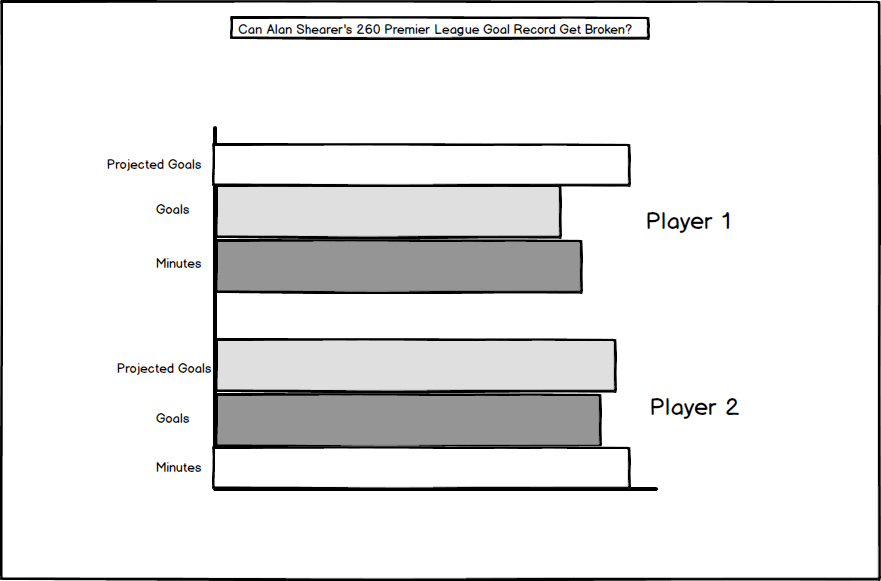

# Task Explanation
This visualisation assignment involved critiquing a data visualisation that I found online and felt could be improved. For this task I chose a visualisation that had to do with soccer, soccer is my favourite sport and something I feel very passionate about. The title of the chosen visualisation, "Will anyone ever beat Shearer's 260 Premier League Goal record". This was a visualisation I felt strongly about because I felt it did not adequately relate to soccer fans who, in my opinion, feel detached when talking about records set in the past. The reason being that, a lot of passionate tech savvy fans are too young to feel connected to these legends, plus the game was just different back then.

# Original visualisation "Will anyone ever beat Shearer's 260 Premier League Goal record"
[https://public.tableau.com/profile/ben7095#!/vizhome/SvKDraft/Yes_ThisTab_](https://public.tableau.com/profile/ben7095#!/vizhome/SvKDraft/Yes_ThisTab_)

# Action
To re-create the visualisation I used a tool named basalmiq to create a wireframe depicting what direction I wanted to go in. I felt it necessary to change the story being told from one that glorified Alan Shearer's goal recored to one that predicted how current stars might fare in challenging his record.

# Feedback
Before moving on to create the new visualisation, I consulted two peers (respoders) to ask about their first impressions of the wireframe.

# Visualization Recreated
To recreate the visualisation, I had to download and clean the original data set. The reason being that it was so large and there was a lot of useless data, additionally, the data needed to display goals/hour was not available in raw form and had to be calculated. As I set out to do, I simplified the data set to allow sports fans, relate and deduce their own story better. The software program I used was Tableau. Unfortunately, I do not think the recreation is perfect. While the colour scheme used (In line with feedback recieved) is better to highlight goals, contextual information is lacking. Going further and with more adept abilities I would add lines and highlights in the visualisation to show which of the players depicted (As a football fan myself I picked the most popular & relevant) had retired, and lines to show what average playing minutes are over a typical career. Unlike with my original vision, I found that executing an expected goals metric would involve creating a dataset that would more or less be reflective of my personal biases. 

<noscript></noscript><object class='tableauViz'  style='display:none;'><param name='host_url' value='https%3A%2F%2Fpublic.tableau.com%2F' /> <param name='embed_code_version' value='3' /> <param name='site_root' value='' /><param name='name' value='WillanyoneeverbeatShearers260goals_15736187073430&#47;Sheet3' /><param name='tabs' value='no' /><param name='toolbar' value='yes' /><param name='static_image' value='https:&#47;&#47;public.tableau.com&#47;static&#47;images&#47;Wi&#47;WillanyoneeverbeatShearers260goals_15736187073430&#47;Sheet3&#47;1.png' /> <param name='animate_transition' value='yes' /><param name='display_static_image' value='yes' /><param name='display_spinner' value='yes' /><param name='display_overlay' value='yes' /><param name='display_count' value='yes' /></object>
                
